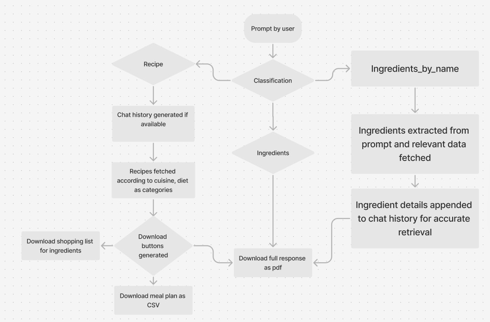

# NutriMate (Nutrition and Recipes RAG App)
[](https://nutrimate-ragnroll.streamlit)

**NutriMate** is an AI-powered RAG (Retrieval-Augmented Generation) app designed to provide users with personalized recipes, detailed nutrition facts, categorized food items, and the ability to compare nutritional information between two items. The app is deployed on **Streamlit Community Cloud**, ensuring seamless access and usability.

### How to run it on your own machine

1. Install the requirements

   ```
   $ pip install -r requirements.txt
   ```

2. Follow the [SNOWFLAKE_SQL_GUIDE](SNOWFLAKE_SQL_GUIDE.md) to create the desired backend

3. Create a .streamlit\sectret.toml 
   ```
   account = "your_account_id"  
   user = "your_username"  
   password = "your_password"  
   role = "your_role"  
   database = "your_database_name"  
   schema = "your_schema_name"  
   warehouse = "your_warehouse_name"  
      
   # Service parameters
   CORTEX_SEARCH_DATABASE = "your_search_database_name"  
   CORTEX_SEARCH_SCHEMA = "your_search_schema_name"  
   RECIPE_SEARCH_SERVICE = "your_recipe_search_service"  
   INGREDIENT_SEARCH_SERVICE = "your_ingredient_search_service"  
   INGREDIENT_BY_NAME_SEARCH_SERVICE = "your_ingredient_by_name_search_service"
   ```

4. Run the app

   ```
   $ streamlit run streamlit_app.py
   ```
---

## Features
- **Recipe Generation**: Dynamically generate recipes based on user preferences, indexed by diet and cuisine.
- **Nutrition Facts Retrieval**: Access accurate nutritional data for various food items.
- **Food Categorization**: Retrieve food items based on predefined categories such as cuisine or diet.
- **Item Comparison**: Compare two food items to analyze and contrast their nutritional values.
- **PDF and CSV Downloads**: 
  - Download responses as PDF for recipe classifications.
  - Export meal plans as CSV.
  - Save shopping cart data as PDF (only for recipe-related queries).

---

## Technical Stack
1. **Database**  
   - **Snowflake**: Acts as the primary database, storing recipes and ingredient data indexed by diet and cuisine.

2. **Search and Retrieval**  
   - **Cortex Search**: Ensures efficient retrieval of relevant data based on user queries.

3. **AI Integration**  
   - **Cortex LLM**: The `CLASSIFY_TEXT()` function is utilized to categorize user queries into:
     - Recipes
     - Ingredients
     - Ingredients by name

4. **Classification System**  
   - **Cuisine-Based Recipes**:
     Recipes are categorized by a wide range of cuisines, such as:
     - Indian (e.g., South Indian, Andhra, Chettinad, Mughlai, etc.)
     - Continental
     - Chinese, Japanese, Korean, and other Asian cuisines
     - Mediterranean, Middle Eastern, and African cuisines
     - European, American, and other global cuisines
     - Desserts, snacks, appetizers, and more
     *(Complete list in the repository.)*
   - **Diet-Based Recipes**:
     Recipes are classified into diets such as:
     - Diabetic-Friendly
     - Vegetarian
     - High Protein (Vegetarian and Non-Vegetarian)
     - Vegan
     - Gluten-Free
     - Sugar-Free
     - Eggetarian
     - No Onion No Garlic (Sattvic)

5. **PDF and CSV Generation**  
   - **FPDF Library**: Allows users to download recipes and shopping carts in PDF format.
   - Export meal plans in CSV format for easy planning and organization.

6. **Frontend**  
   - **Streamlit**: Offers a user-friendly interface with custom HTML adjustments for improved experience.

7. **Datasets**  
   - Recipes and ingredient data were sourced from **Kaggle**.
   - *https://www.kaggle.com/datasets/sooryaprakash12/cleaned-indian-recipes-dataset*,    
   - *https://www.kaggle.com/datasets/trolukovich/nutritional-values-for-common-foods-and-products*

8. **Deployment**  
   - Deployed on **Streamlit Community Cloud**, ensuring smooth and convenient access.

---
## Workflow


---

## How to Use
1. **Interact with the Chatbot**:
   - Generate recipes tailored to your cuisine and diet preferences.
   - Retrieve detailed nutrition facts for desired food items.
   - Explore food categories (e.g., cuisines or diets).
   - Compare nutritional values of two items.

2. **Download Your Results**:
   - Save recipes and shopping cart data as PDFs.
   - Export meal plans as CSV files.

---
